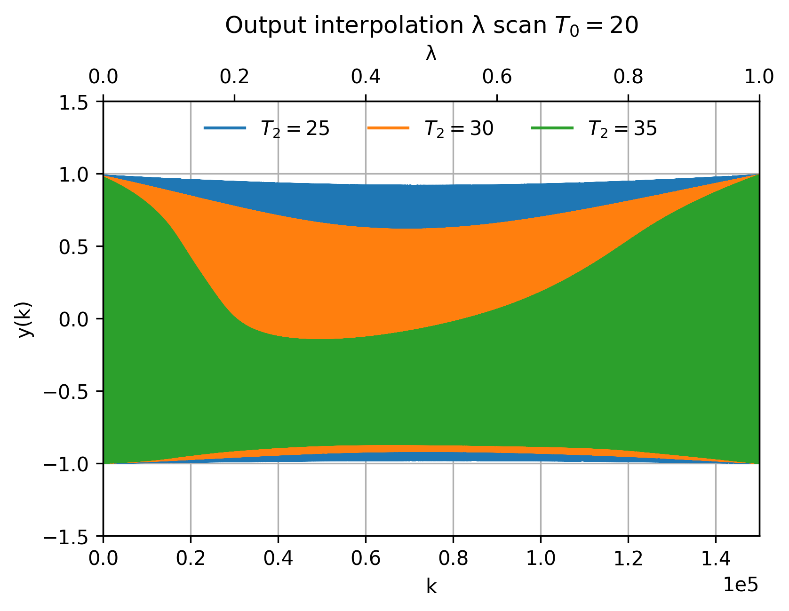
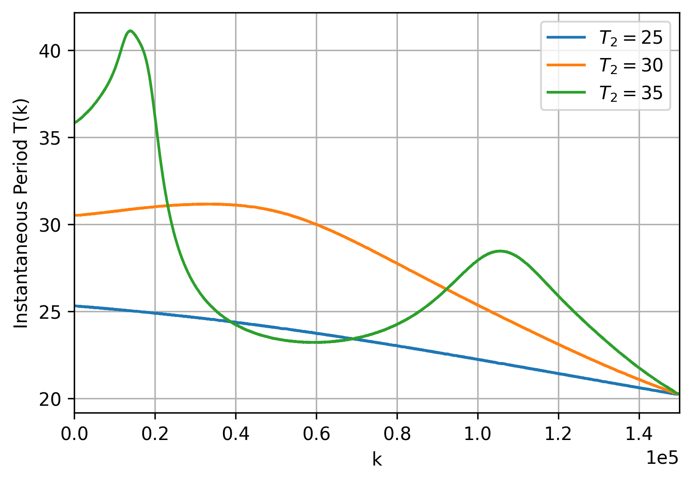
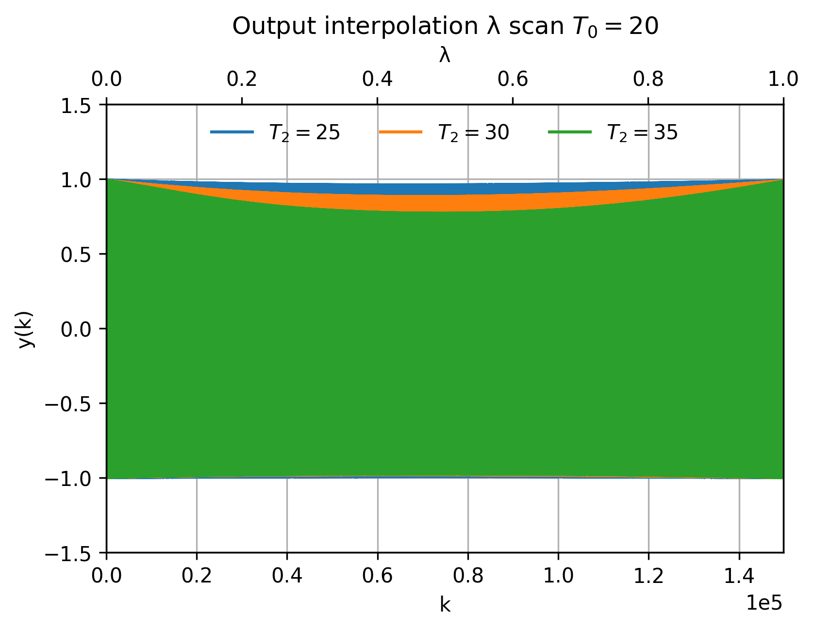
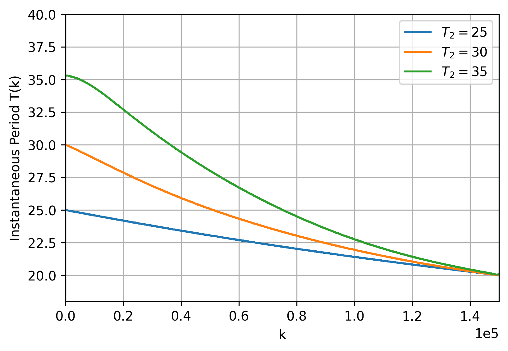

# Adaptation in Neuromorphic Chips

This repository is part of the **NEHIL project**, funded by ChipsJU (EU) and the Korean NRF, ([NEHIL.eu](https://www.nehil.eu/), Project ID [101194363](https://cordis.europa.eu/project/id/101194363)), which addresses the growing need for more efficient and powerful computing systems by developing new neuromorphic architectures.  

Within this context, the repository presents an exploration of **conceptors** and the **Conceptor Control Loop (CCL)**, inspired in Pourcel et al. (2024), to enhance the adaptivity of **Reservoir Computing (RC)** systems and to assess their potential for **neuromorphic implementations**.  

The study demonstrates how conceptors can go beyond static projections by adapting online through the CCL, enabling RC systems to dynamically adjust to new temporal patterns, an essential property for robust neuromorphic computation.

The reservoir is implemented using an Echo State Network (ESN).

---

## Task 1: Sinusoidal Interpolation

The ESN was trained with **two sine waves** of equal amplitude but different periods.  
Each sine wave defines a distinct internal reservoir state, represented by two conceptors: **C₁** and **C₂**.  

To interpolate between them, the following definition is used:

$$
C_{interp} = \lambda C_{1} + (1-\lambda)C_{2}, \quad \lambda \in [0,1]
$$

The objective is to generate an output corresponding to the interpolated conceptor $C_{interp}$.

---
## Task 2: Network degradation
For this task, the ESN was trained on a single sinusoidal signal and then was **progressively degraded** by disabling different subsets of neurons. The goal was to evaluate the **robustness** of the ESN, to this end, two approaches are considered: applying a constant conceptor (corresponding to the trained sinusoidal signal) and applying the Conceptor Control Loop (CCL). Their performance is compared in order to demonstrate that the adaptive nature of the CCL provides a clear advantage in maintaining network robustness.

This experiment is directly related to the notion of **"graceful degradation"**, a property shared by both artificial and biological neural networks, where performance decreases gradually as more units are lost (McClelland et al. (1986)). 

---
## Repository Structure
- **`utils`**
	- **`rrnn_utils.py`**   
  Contains functions for training the reservoir, computing internal states, and calculating conceptors.  

	- **`utils.py`**  
  Provides functions for visualization and results presentation.  

- **`sw_interpolation.py`**  
  Implements interpolation using a *fixed* interpolated conceptor $C_{\text{interp}}$.  

- **`sw_interpolation_CCL.py`**   
  Implements interpolation using the **Conceptor Control Loop (CCL)**.
  
- **`network_degradation.py`**  
   Implements manual degradation of the network and compares the principal components of the internal states between the intact network and the degraded network when using either a constant conceptor or the CCL. 	  The script also visualizes the corresponding outputs for each case.
  
- **`network_degradation_loop.py`**  
   Performs a qualitative evaluation of the performance of the constant conceptor and the CCL under progressive degradation, by randomly removing K neurons across multiple trials.
  
---

## Results
### Task 1
By scanning the interpolation parameter $\lambda \in [0,1]$, the following observations were obtained:  

- The **constant interpolated conceptor** can perform interpolation only under limited conditions. As illustrated in the figures below, the greater the difference between the periods of the sine waves used to train the ESN, the more difficult it becomes for the constant conceptor to achieve successful interpolation.
  

  
|  |  |
|:-------------------------------------------------------------------------------------------------------------:|:-----------------------------------------------------------------------------------------------------------------------------:|
| *Figure 1 a). Interpolation with constant conceptor*                                                             | *Figure 1 b). Instantaneous period with constant conceptor*                                                                      |

  
- However, when the **Conceptor Control Loop (CCL)** is applied, the range of conditions where interpolation can be successfully achieved is significantly extended.

  
|  |  |
|:-------------------------------------------------------------------------------------------------------------:|:-----------------------------------------------------------------------------------------------------------------------------:|
| *Figure 2 a). Interpolation with CCL*                                                             | *Figure 2 b). Instantaneous period with CCL*                                                                      |

 

These results are consistent with the findings of Pourcel et al. (2024), emphasizing the potential of adaptive mechanisms for neuromorphic hardware applications.

### Task 2
A **qualitative assessment** was conducted after the removal of K neurons. For each increment of K, 70 trials were performed with randomly removed neurons. The network was considered to fail when the variance of the principal component of the degraded network ($\sigma^2_{degraded}$) dropped below 10% of the variance observed in the non-degraded network ($\sigma^2$).

$$
\sigma^2_{degraded}< 0.1 \cdot \sigma^2
$$

As an example, the following figure shows that when a constant conceptor is applied, the PCA of the degraded network tends to converge to a fixed point. In contrast, with the CCL, the PCA preserves part of the dynamics of the non-degraded network. In this case, the constant conceptor is considered a failure, whereas the CCL is not, according to the qualitative evaluation.

|  |
|:--------------------------------------------------------------------------------------------------------------------------------------------------------------------------------------------:|
| *Figure 3. PCA comparison after removing 80 neurons from a 560-neuron ESN.* |

The results show that, when using either a constant conceptor or the CCL, the failure rate of the network with 10.7% of its neurons disabled (60 neurons) remains below 20%. Furthermore, with the CCL, the failure rate can be reduced to about 5% under the same level of degradation and maintained below 20% even for higher levels of degradation. These findings highlight the effectiveness of the Conceptor Control Loop in enhancing the robustness of Reservoir Computing systems.

|  |
|:--------------------------------------------------------------------------------------------------------------------------------------------------------------------------------------------:|
| *Figure 4. Qualitative evaluation for an ESN of 560 neurons* |

---

## References

- G. Pourcel, M. Goldmann, I. Fischer, and M. C. Soriano, *Adaptive control of recurrent neural networks using conceptors*, Chaos: An Interdisciplinary Journal of Nonlinear Science, vol. 34, no. 6, p. 063118, 2024. [https://doi.org/10.1063/5.0211692](https://doi.org/10.1063/5.0211692)

- J. L. McClelland, D. E. Rumelhart, and P. R. Group, *Parallel Distributed Processing, Volume 2: Explorations in the Microstructure of Cognition: Psychological and Biological Models*. The MIT Press, 1986.

